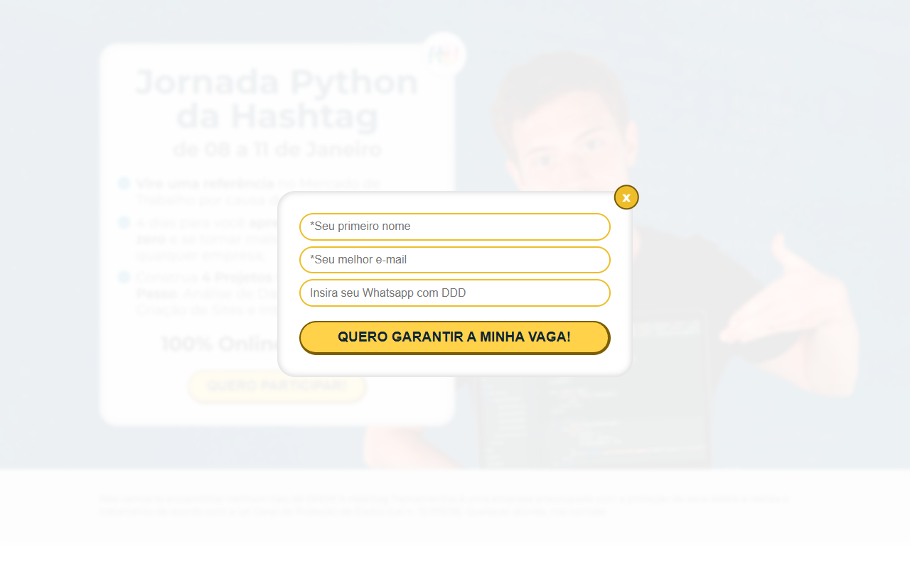
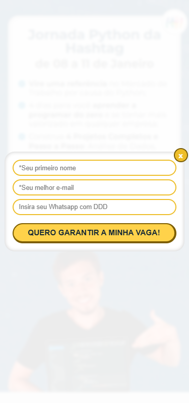

# QA Report with Images

Data: 2025-10-05

Este relatório inclui as screenshots geradas automaticamente pelo script `qa/run-qa.js`.

## Artefatos gerados

- `qa/screenshots/inscricao-desktop.png` — Página carregada em desktop
- `qa/screenshots/popup-aberto-desktop.png` — Estado após clicar em "Quero participar!" no desktop
- `qa/screenshots/inscricao-mobile.png` — Página carregada em viewport mobile
- `qa/screenshots/popup-aberto-mobile.png` — Estado após clicar em "Quero participar!" no mobile

## Visualizações

### Desktop — página principal

### Desktop — popup aberto

### Mobile — página principal

### Mobile — popup aberto

## Observações

- Todas as imagens foram capturadas automaticamente usando Puppeteer.
- O popup é acionado pelo botão com classes `botao--amarelo js-botao` e o estado visível é representado pela classe `popup--aberto` no `body`.
- Se alguma imagem não carregar no seu visualizador local, verifique o caminho relativo `qa/screenshots/`.

## Próximos passos sugeridos

- Revisão visual manual para confirmar texto, contrastes e legibilidade em cada breakpoint.
- Adicionar testes visuais (ex.: regressão com Percy/Backstop) se o projeto crescer.

---

Relatório gerado automaticamente.
